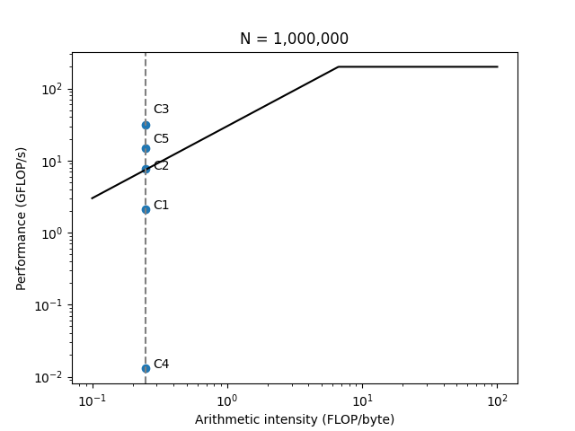
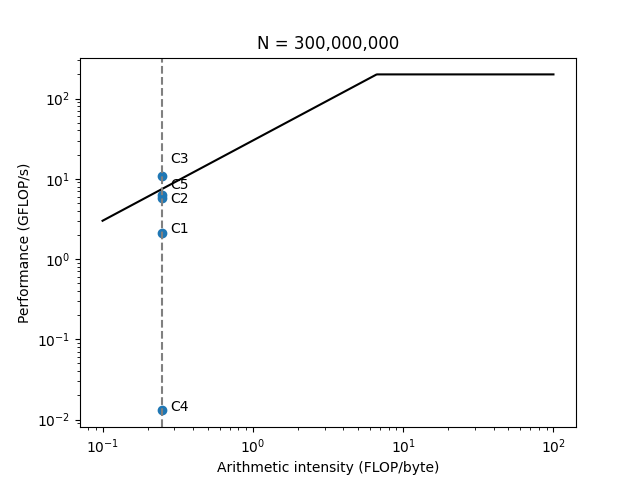

# Dot Product Microbenchmarks: C, MKL, and Python on the Roofline

## Abstract

This project benchmarks five implementations of a single-precision dot product (`R = Σ A[i]·B[i]`) and places every result on a roofline model. The implementations are:

- **C:** a simple loop, the same loop unrolled by four, and Intel MKL `cblas_sdot`
- **Python:** a pure element-by-element loop, and `numpy.dot`

Each is measured at N = 10⁶ (8 MB, largely cache-resident) and N = 3×10⁸ (2.4 GB, streamed from DRAM). With an arithmetic intensity of 0.25 FLOP/byte, every implementation is memory bound, so they differ only in how close they get to the bandwidth roof. At N = 3×10⁸, unrolling speeds up the C loop by 2.7× by breaking its chain of dependent additions, and MKL is fastest at 5.1×. The pure Python loop is about 170× slower than C because of per-element interpreter overhead.

Accuracy and speed turn out to be linked. A single float32 accumulator stalls at 2²⁴ = 16,777,216, and the unrolled loop at 2²⁶ = 67,108,864, while MKL, NumPy, and the float64 Python loop all return the exact result.

The full analysis is in the [report](report.pdf). It covers warm-up exclusion and the choice of mean, the roofline analysis, the performance comparison, and numerical accuracy.

## Experimental setup

| Item | Value |
|---|---|
| CPU | _fill in from `lscpu`_ |
| Machine type | GCP e2-standard-8 (8 vCPUs, 32 GB RAM) |
| OS | Debian 12 (bookworm) |
| Disk | 50 GB balanced persistent disk |
| Zone | us-central1-a |

### Software stack

| Component | Version / details |
|---|---|
| Compiler | GCC 12 (Debian 12 default), `-O3 -Wall` |
| BLAS (C) | Intel oneAPI MKL, linked via `-lmkl_rt` |
| Python | Python 3 in an isolated `venv` |
| Python packages | `numpy`, `matplotlib` |

### Environment setup

1. Install build essentials (`build-essential`) and Intel oneAPI MKL. MKL is x86-64 only.
2. Load the MKL environment with `source /opt/intel/oneapi/setvars.sh`.
3. Create and activate a virtual environment, then install the dependencies:
   ```bash
   python3 -m venv .venv && source .venv/bin/activate
   pip install numpy matplotlib
   ```
4. Build and run the C benchmarks with `make run_dp1 run_dp2 run_dp3`, and the Python benchmarks with `bash run_py.sh`.
5. Generate the roofline plot with `python3 plot_roofline.py`.

### Benchmark methodology

- **Input sizes:** N = 10⁶ with 1000 repetitions and N = 3×10⁸ with 20 repetitions, float32 vectors with every element set to 1.0.
- **Timing:** only the dot-product call is timed, with `clock_gettime(CLOCK_MONOTONIC)` in C and `time.perf_counter()` in Python.
- **Warm-up:** the reported time is the mean of the second half of the repetitions, excluding cold caches and library initialization.
- **Metrics:** bandwidth B = 8N / T and throughput F = 2N / T, computed from the mean time.
- **Dead-code elimination:** the result is stored in a `volatile` variable and printed.
- **Runs:** each configuration is averaged over three runs.
- **Roofline:** reference peak of 200 GFLOP/s and 30 GB/s.

## Results

### N = 1,000,000

| Benchmark | Implementation | Time (s) | Bandwidth (GB/s) | GFLOP/s | R |
|---|---|---|---|---|---|
| C1 | C loop | 9.43e-04 | 8.480 | 2.120 | 1,000,000 |
| C2 | C unrolled ×4 | 2.63e-04 | 30.464 | 7.616 | 1,000,000 |
| C3 | Intel MKL | 6.39e-05 | 125.106 | 31.277 | 1,000,000 |
| C4 | Python loop | 1.554e-01 | 0.051 | 0.013 | 1,000,000 |
| C5 | NumPy | 1.35e-04 | 59.358 | 14.840 | 1,000,000 |



### N = 300,000,000

| Benchmark | Implementation | Time (s) | Bandwidth (GB/s) | GFLOP/s | R |
|---|---|---|---|---|---|
| C1 | C loop | 2.823e-01 | 8.500 | 2.125 | 16,777,216 |
| C2 | C unrolled ×4 | 1.034e-01 | 23.202 | 5.801 | 67,108,864 |
| C3 | Intel MKL | 5.492e-02 | 43.697 | 10.924 | 300,000,000 |
| C4 | Python loop | 4.798e+01 | 0.050 | 0.013 | 300,000,000 |
| C5 | NumPy | 9.455e-02 | 25.384 | 6.346 | 300,000,000 |



## Attribution

This work was completed as a homework assignment for COMS 6998: High Performance Machine Learning at Columbia University, taught by Dr. Kaoutar El Maghraoui. The dot-product function bodies (`dp`, `dpunroll`, `bdp`) and the output format were specified by the assignment. The benchmark harnesses, build setup, and plotting code were developed by the author. This report was written with the assistance of AI; all experimental results were produced and verified by the author.

---

*Nrushad Joshi, Columbia University*
