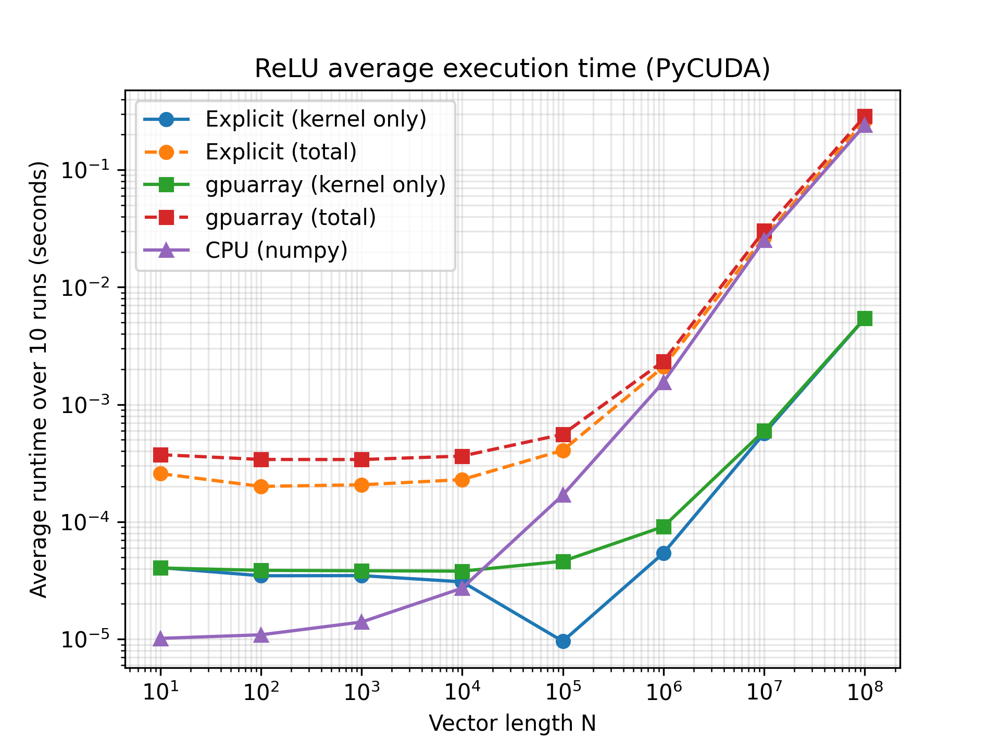
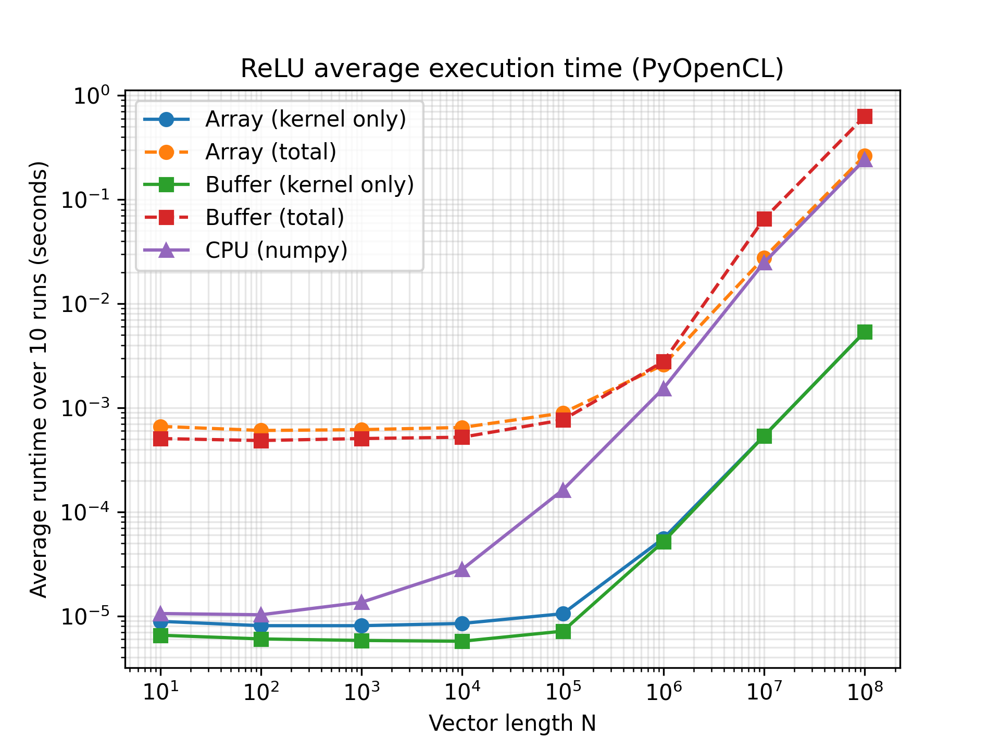

# ReLU on the GPU: PyCUDA vs PyOpenCL

## Abstract

This project implements an element-wise ReLU (`out[i] = max(in[i], 0)`) kernel in both CUDA (via PyCUDA) and OpenCL (via PyOpenCL). It benchmarks them against a NumPy CPU baseline for vector sizes from 10 to 10⁸. For each API, two host-side memory-management strategies are compared:

- **PyCUDA:** high-level `gpuarray` vs explicit `mem_alloc` / `memcpy`
- **PyOpenCL:** `pyopencl.array` vs raw `cl.Buffer` / `enqueue_copy`

Kernel-only and end-to-end times are measured separately. The GPU kernel outperforms NumPy for large inputs: from N ≈ 10⁵ in PyCUDA, and at every tested size in PyOpenCL. End-to-end, though, NumPy is faster at every tested size, because moving data to and from the GPU takes most of the time.

The full analysis is in the [report](report.pdf). It covers synchronization, the trade-offs between high-level arrays and explicit memory management, and scaling limits.

## Experimental setup

| Item | Value |
|---|---|
| GPU | 1× NVIDIA Tesla P4 (Pascal, 8 GB GDDR5) |
| Machine type | GCP n1-standard-4 (4 vCPUs, 15 GB RAM) |
| OS | Ubuntu 22.04 LTS |
| Disk | 50 GB persistent |
| Zone | us-east4-b |

### Software stack

| Component | Version / details |
|---|---|
| CUDA Toolkit | 12.6.1 (includes `nvcc`, Nsight Systems `nsys`, Nsight Compute `ncu`) |
| NVIDIA driver | 560.35.03 (bundled with the CUDA 12.6.1 runfile installer) |
| Compiler | GCC 12, matched to the GCC version used to build the VM's Linux kernel |
| Python | Python 3 in an isolated `venv` |
| GPU libraries | `pycuda`, `pyopencl` (OpenCL via the NVIDIA CUDA platform) |
| Python packages | `numpy`, `matplotlib` |

### Environment setup

1. Install build essentials (`build-essential`, `dkms`). Make sure the system GCC matches the kernel's GCC (check with `cat /proc/version`).
2. Install CUDA Toolkit 12.6.1 with NVIDIA's runfile installer. Verify the driver with `nvidia-smi`.
3. Add `/usr/local/cuda-12.6/bin` to `PATH` and the CUDA `lib` directory to `LD_LIBRARY_PATH`. Confirm with `nvcc --version`.
4. Enable non-admin profiler access by setting `NVreg_RestrictProfilingToAdminUsers=0` in `/etc/modprobe.d/`, then reboot.
5. Create and activate a virtual environment, then install the dependencies:
   ```bash
   python3 -m venv cuda_cl && source cuda_cl/bin/activate
   pip install numpy matplotlib pycuda pyopencl
   ```
6. Confirm both runtimes can see the GPU. Query `cuda.Device(0).name()` in PyCUDA and list the devices under `cl.get_platforms()` in PyOpenCL.

### Benchmark methodology

- **Input sizes:** N = 10¹ to 10⁸, float32, each time averaged over 10 runs.
- **PyCUDA timing:** CUDA events for both kernel-only and end-to-end time.
- **PyOpenCL timing:** OpenCL event profiling for kernel time and `time.time()` for end-to-end time.
- **End-to-end** includes device allocation, the host-to-device copy, the kernel, and the device-to-host copy.
- **Correctness:** checked against NumPy for edge cases, including a single element, all-negative and all-positive inputs, a non-multiple of the block size, and a 25M-element vector.

## Results

### PyCUDA (seconds)

| N | Explicit kernel | Explicit total | gpuarray kernel | gpuarray total | CPU |
|---|---|---|---|---|---|
| 10¹ | 4.076e-05 | 2.580e-04 | 4.045e-05 | 3.739e-04 | 1.016e-05 |
| 10² | 3.472e-05 | 2.005e-04 | 3.860e-05 | 3.402e-04 | 1.090e-05 |
| 10³ | 3.482e-05 | 2.069e-04 | 3.830e-05 | 3.397e-04 | 1.400e-05 |
| 10⁴ | 3.082e-05 | 2.291e-04 | 3.800e-05 | 3.636e-04 | 2.723e-05 |
| 10⁵ | 9.600e-06 | 4.072e-04 | 4.618e-05 | 5.578e-04 | 1.692e-04 |
| 10⁶ | 5.416e-05 | 2.095e-03 | 9.112e-05 | 2.340e-03 | 1.552e-03 |
| 10⁷ | 5.670e-04 | 2.661e-02 | 5.969e-04 | 3.024e-02 | 2.522e-02 |
| 10⁸ | 5.424e-03 | 2.626e-01 | 5.435e-03 | 2.864e-01 | 2.407e-01 |



### PyOpenCL (seconds)

| N | Array kernel | Array total | Buffer kernel | Buffer total | CPU |
|---|---|---|---|---|---|
| 10¹ | 8.909e-06 | 6.639e-04 | 6.554e-06 | 5.068e-04 | 1.059e-05 |
| 10² | 8.093e-06 | 6.062e-04 | 6.038e-06 | 4.854e-04 | 1.030e-05 |
| 10³ | 8.090e-06 | 6.174e-04 | 5.837e-06 | 5.069e-04 | 1.357e-05 |
| 10⁴ | 8.499e-06 | 6.478e-04 | 5.734e-06 | 5.222e-04 | 2.811e-05 |
| 10⁵ | 1.055e-05 | 8.920e-04 | 7.168e-06 | 7.658e-04 | 1.628e-04 |
| 10⁶ | 5.581e-05 | 2.593e-03 | 5.192e-05 | 2.784e-03 | 1.538e-03 |
| 10⁷ | 5.392e-04 | 2.770e-02 | 5.370e-04 | 6.546e-02 | 2.485e-02 |
| 10⁸ | 5.366e-03 | 2.647e-01 | 5.367e-03 | 6.309e-01 | 2.424e-01 |



## Attribution

This work was completed as a homework assignment for EECS E4750: Heterogeneous Computing for Signal and Data Processing at Columbia University, taught by Prof. Zoran Kosti\'c. The assignment template, test harness, benchmarking code, and the OpenCL kernel were provided by the course. The CUDA kernel and all host code were developed by the author. This report was written with the assistance of AI; all experimental results were produced and verified by the author.

---

*Nrushad Joshi, Columbia University*
